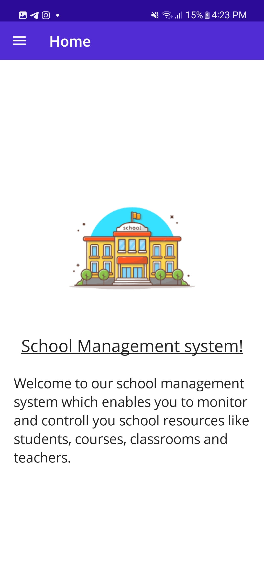
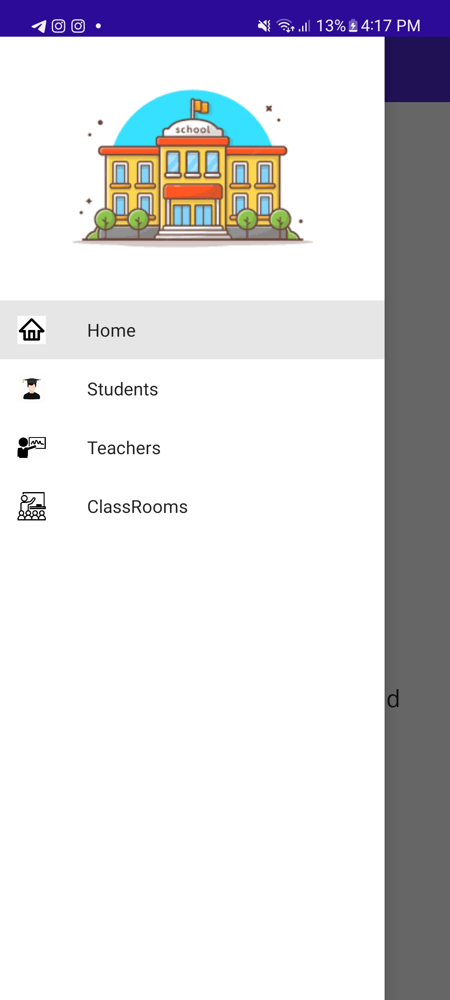
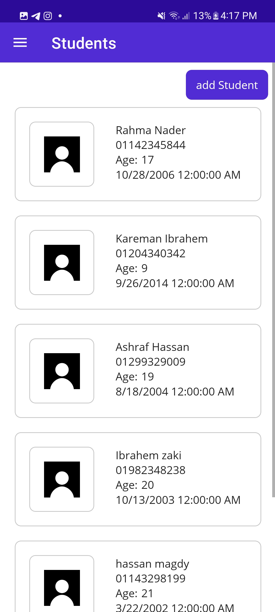
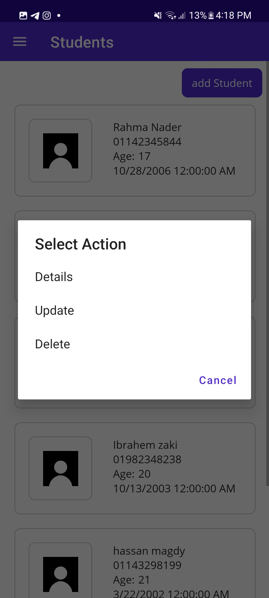
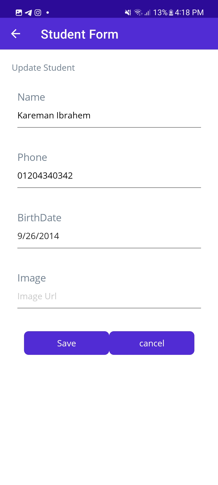

# School Management System Maui App

The **School Management System** is a comprehensive web application developed using ASP.NET and Blazor WebAssembly. 🚀 It is meticulously designed to streamline and enhance the management of educational institutions. This powerful system empowers administrators to efficiently handle various aspects of school management, fostering a more organized and effective educational environment.

## Key Features:

- **Efficient Classroom Management:** Seamlessly create, modify, and remove classrooms within the system.
- **Intuitive Course Management:** Effortlessly handle courses, from creation to modification and deletion.
- **Structured Subject Management:** Efficiently manage subjects associated with each course.
- **Teacher Profiling:** Create, edit, and remove teacher profiles, including essential details.
- **Visual Analytics:** Gain insightful visual analytics to assess classroom and course performance through graphical representations. 📊

## System Capabilities:

- **Graphical Classroom Representations:** View classrooms through an intuitive graphical interface for quick navigation.
- **Graphical Course Rates:** Visualize the popularity and success rates of courses through interactive graphs. 📈
- **Detailed Subject Information:** Access comprehensive details about each subject within the system.

  
  
  
  
  

## System Advantages:

- **User-Friendly Interface:** Navigate through the system seamlessly with an intuitive and user-friendly dashboard.
- **Responsive Design:** Access the system from various devices with a responsive and adaptable design.
- **Security and Access Control:** Implement role-based access control to ensure secure data handling and prioritize the confidentiality of sensitive information.

The **School Management System** offers a robust and scalable solution tailored to meet the diverse needs of educational institutions. Whether you're an administrator, teacher, or other staff member, this system provides the necessary tools for efficient school management while offering valuable insights through visual analytics. Elevate the educational experience by adopting our comprehensive and user-friendly solution. 🏫💻

Certainly! Here's the revised section focusing on the Mobile Application Repository:

## Web Application Repository:

Explore our Web application repository for on-the-go access and convenience. Our web app complements the web-based system, providing a seamless experience across different devices. Find the web app repository [here](https://github.com/AhmedYounis20/SchoolManagmentSystem). 📱

## Technologies Used:

1. **ASP.NET:**
     
     

   ASP.NET provides the server-side framework for building scalable and high-performance web applications.

2. **.NET MAUI:**
   
    
  
   .NET MAUI extends the application to mobile devices, providing a native cross-platform mobile app experience.

3. **Blazor:**
  

   Blazor WebAssembly is at the heart of our application, enabling the development of interactive and dynamic user interfaces directly in the browser.

4. **Bootstrap:**

   

   Bootstrap ensures a responsive and visually appealing design, enhancing the user interface across various devices.

5. **HTML and CSS:**

     
     

   HTML and CSS are the foundational technologies for structuring content and styling the application.

Explore the synergy of these technologies, ensuring a modern, responsive, and feature-rich environment for effective school management.
